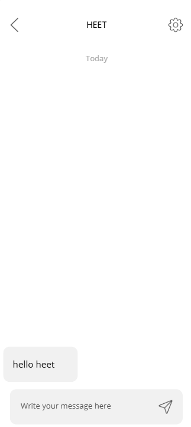
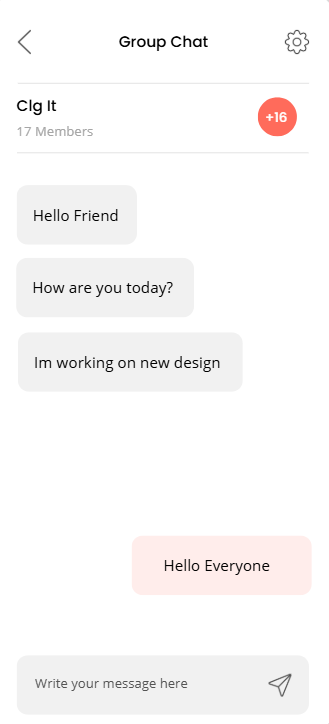

# 💬 Simple Chat App (Personal + Group Messaging)

🚀 A modern Android Chat Application that supports **personal messaging** and **group chats** with a clean UI and smooth experience.

---

## ✨ Features

🔥 **Personal Chat**
- One-to-one messaging  
- Real-time chat system  
- Simple & clean interface  

👥 **Group Chat**
- Create group chats  
- Send messages in groups  
- Multiple users interaction  

⚡ **Fast & Lightweight**
- Smooth performance  
- Optimized UI  

🎨 **Attractive UI**
- Modern design  
- User-friendly experience  

---

## 📱 Screenshots

  
  
  
  
  

---

## 🛠️ Tech Stack

- 💻 **Language:** Java  
- 📱 **Platform:** Android  
- 🔥 **Backend:** Firebase (Realtime Database / Firestore)  
- 🔐 **Authentication:** Firebase Auth  
- 🎨 **UI:** XML Layouts  

---

## 📂 Project Structure
SimpleChatApp/
│── Activities/
│── Adapters/
│── Models/
│── Firebase/
│── Layouts/
│── Utils/

## 🚀 Future Improvements

- ✅ Image & File Sharing  
- ✅ Voice Messages  
- ✅ Online/Offline Status  
- ✅ Message Seen Indicator  

---

## 🤝 Contributing

Contributions are welcome!  
Feel free to fork this repo and improve the app.

---

## 📧 Contact

👤 Developer: **Heet Menpara**  
📩 Email: Heetmenpara@gmail.com  

---

## ⭐ Support

If you like this project, give it a ⭐ on GitHub!

---

🔥 **"Connect people. Chat anytime. Anywhere."**
